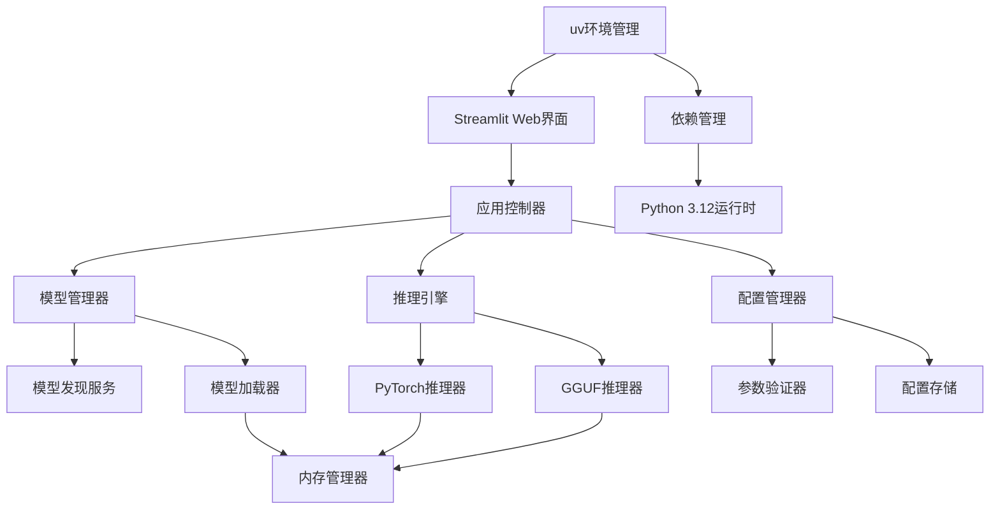

# 设计文档

## 概述

多LLM模型比较器采用模块化架构设计，基于Python 3.12和uv包管理器，使用Streamlit框架构建Web界面，支持PyTorch和GGUF两种模型格式的本地推理。系统采用内存优化策略，通过动态加载和卸载模型来控制资源使用，同时提供流式输出和实时比较功能。项目结构遵循现代Python开发最佳实践，使用uv进行依赖管理和虚拟环境隔离。

## 架构设计

### 项目结构

```
multi-llm-comparator/
├── pyproject.toml              # uv项目配置文件
├── uv.lock                     # uv依赖锁定文件
├── README.md                   # 项目说明文档
├── .python-version             # Python版本指定
├── src/
│   └── multi_llm_comparator/
│       ├── __init__.py
│       ├── main.py             # Streamlit应用入口
│       ├── core/
│       │   ├── __init__.py
│       │   ├── models.py       # 数据模型定义
│       │   ├── config.py       # 配置管理
│       │   └── exceptions.py   # 自定义异常
│       ├── services/
│       │   ├── __init__.py
│       │   ├── model_manager.py    # 模型管理服务
│       │   ├── inference_engine.py # 推理引擎
│       │   └── memory_manager.py   # 内存管理
│       ├── inferencers/
│       │   ├── __init__.py
│       │   ├── base.py         # 基础推理器
│       │   ├── pytorch_inferencer.py
│       │   └── gguf_inferencer.py
│       └── ui/
│           ├── __init__.py
│           ├── components.py   # UI组件
│           └── utils.py        # UI工具函数
├── tests/
│   ├── __init__.py
│   ├── test_model_manager.py
│   ├── test_inferencers.py
│   └── test_ui.py
└── models/                     # 本地模型存储目录
    ├── pytorch/
    └── gguf/
```

### 系统架构图



### 核心组件

1. **uv环境管理** - 使用uv管理Python 3.12虚拟环境和依赖
2. **Streamlit Web界面** - 用户交互的前端界面
3. **应用控制器** - 协调各组件间的交互和数据流
4. **模型管理器** - 负责模型发现、选择和生命周期管理
5. **推理引擎** - 处理不同类型模型的推理请求
6. **配置管理器** - 管理用户配置和参数验证
7. **内存管理器** - 优化内存使用和模型加载策略

## 组件和接口设计

### 1. 项目配置 (pyproject.toml)

**职责：**
- 定义项目元数据和依赖
- 配置uv包管理器设置
- 指定Python版本要求

**配置示例：**
```toml
[project]
name = "multi-llm-comparator"
version = "0.1.0"
description = "本地部署的多LLM模型比较器"
requires-python = ">=3.12"
dependencies = [
    "streamlit>=1.28.0",
    "torch>=2.1.0",
    "transformers>=4.35.0",
    "llama-cpp-python>=0.2.0",
    "psutil>=5.9.0",
    "pydantic>=2.5.0",
]

[build-system]
requires = ["hatchling"]
build-backend = "hatchling.build"

[tool.uv]
dev-dependencies = [
    "pytest>=7.4.0",
    "black>=23.0.0",
    "ruff>=0.1.0",
]
```

### 2. 模型管理器 (ModelManager)

**职责：**
- 扫描和发现本地模型文件
- 管理模型的选择和配置
- 协调模型的加载和卸载

**主要接口：**
```python
class ModelManager:
    def scan_models(self, directory: str) -> List[ModelInfo]
    def get_available_models(self) -> List[ModelInfo]
    def select_models(self, model_ids: List[str]) -> bool
    def get_selected_models(self) -> List[ModelInfo]
```

### 3. 推理引擎 (InferenceEngine)

**职责：**
- 根据模型类型选择合适的推理器
- 管理推理过程和流式输出
- 处理推理错误和异常

**主要接口：**
```python
class InferenceEngine:
    def create_inferencer(self, model_info: ModelInfo) -> BaseInferencer
    def run_inference(self, prompt: str, models: List[ModelInfo]) -> Iterator[InferenceResult]
    def cleanup_resources(self) -> None
```

### 4. 基础推理器 (BaseInferencer)

**职责：**
- 定义推理器的通用接口
- 实现流式输出的基础逻辑

**主要接口：**
```python
class BaseInferencer(ABC):
    @abstractmethod
    def load_model(self, model_path: str, config: Dict) -> None
    
    @abstractmethod
    def generate_stream(self, prompt: str) -> Iterator[str]
    
    @abstractmethod
    def unload_model(self) -> None
    
    @abstractmethod
    def get_model_info(self) -> Dict
```

### 5. PyTorch推理器 (PyTorchInferencer)

**职责：**
- 使用transformers库加载PyTorch模型
- 实现PyTorch模型的流式推理

**实现细节：**
```python
class PyTorchInferencer(BaseInferencer):
    def __init__(self):
        self.model = None
        self.tokenizer = None
        
    def load_model(self, model_path: str, config: Dict) -> None:
        # 使用transformers库加载模型和tokenizer
        # 配置GPU/CPU设备，支持CUDA和MPS
        # 设置推理参数和内存优化选项
        # 支持.safetensors格式的模型文件
        
    def generate_stream(self, prompt: str) -> Iterator[str]:
        # 实现流式生成逻辑
        # 使用TextIteratorStreamer实现实时输出
        # 支持中断和错误恢复机制
```

### 6. GGUF推理器 (GGUFInferencer)

**职责：**
- 使用llama-cpp-python加载GGUF模型
- 实现GGUF模型的流式推理

**实现细节：**
```python
class GGUFInferencer(BaseInferencer):
    def __init__(self):
        self.llm = None
        
    def load_model(self, model_path: str, config: Dict) -> None:
        # 使用llama-cpp-python加载GGUF模型
        # 配置上下文长度、线程数和硬件加速
        # 支持GPU加速(CUDA/OpenCL/Metal)
        
    def generate_stream(self, prompt: str) -> Iterator[str]:
        # 使用llama-cpp-python的流式生成功能
        # 实现token级别的流式输出
```

## 数据模型

### ModelInfo
```python
@dataclass
class ModelInfo:
    id: str
    name: str
    path: str
    model_type: ModelType  # PYTORCH or GGUF
    size: int
    config: Dict[str, Any]
    
class ModelType(Enum):
    PYTORCH = "pytorch"
    GGUF = "gguf"
```

### InferenceResult
```python
@dataclass
class InferenceResult:
    model_id: str
    content: str
    is_complete: bool
    error: Optional[str]
    stats: InferenceStats

@dataclass
class InferenceStats:
    start_time: float
    end_time: Optional[float]
    token_count: int
    tokens_per_second: Optional[float]
```

### ModelConfig
```python
@dataclass
class ModelConfig:
    # 通用参数
    temperature: float = 0.7
    max_tokens: int = 512
    top_p: float = 0.9
    
    # PyTorch特定参数
    do_sample: bool = True
    pad_token_id: Optional[int] = None
    eos_token_id: Optional[int] = None
    
    # GGUF特定参数  
    top_k: int = 40
    repeat_penalty: float = 1.1
    n_ctx: int = 2048
    n_threads: Optional[int] = None
    use_gpu: bool = True
    
    # 内存管理参数
    low_cpu_mem_usage: bool = True
    torch_dtype: str = "auto"
```

## 错误处理策略

### 1. 模型加载错误
- **文件不存在**：显示友好错误信息，建议检查路径
- **内存不足**：提示用户减少同时比较的模型数量
- **格式不支持**：跳过不支持的文件，记录警告日志

### 2. 推理过程错误
- **生成中断**：显示已生成的部分内容和错误信息
- **超时处理**：设置合理的超时时间，避免界面卡死
- **参数无效**：实时验证参数，提供修正建议

### 3. 内存管理错误
- **卸载失败**：强制垃圾回收，记录错误日志
- **资源泄漏**：实现资源监控和自动清理机制

## 测试策略

### 1. 单元测试
- **模型发现功能**：测试不同格式文件的识别
- **参数验证**：测试各种边界条件和无效输入
- **推理器功能**：使用模拟模型测试推理逻辑

### 2. 集成测试
- **端到端流程**：从模型选择到结果输出的完整流程
- **内存管理**：验证模型加载和卸载的正确性
- **并发处理**：测试多模型顺序处理的稳定性

### 3. 性能测试
- **内存使用**：监控不同模型大小下的内存占用
- **响应时间**：测试流式输出的实时性
- **资源清理**：验证模型卸载后的资源释放

### 4. 用户界面测试
- **交互响应**：测试Streamlit界面的用户体验
- **错误显示**：验证错误信息的清晰度和有用性
- **数据导出**：测试各种格式的结果导出功能