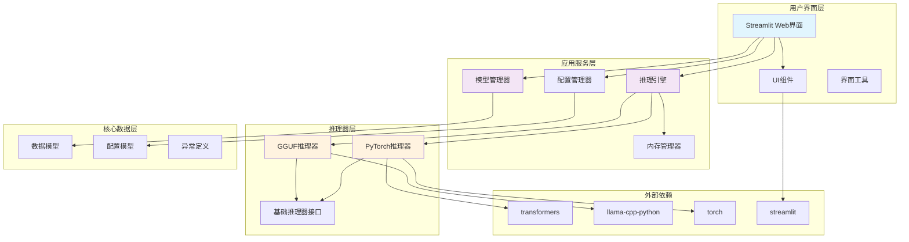
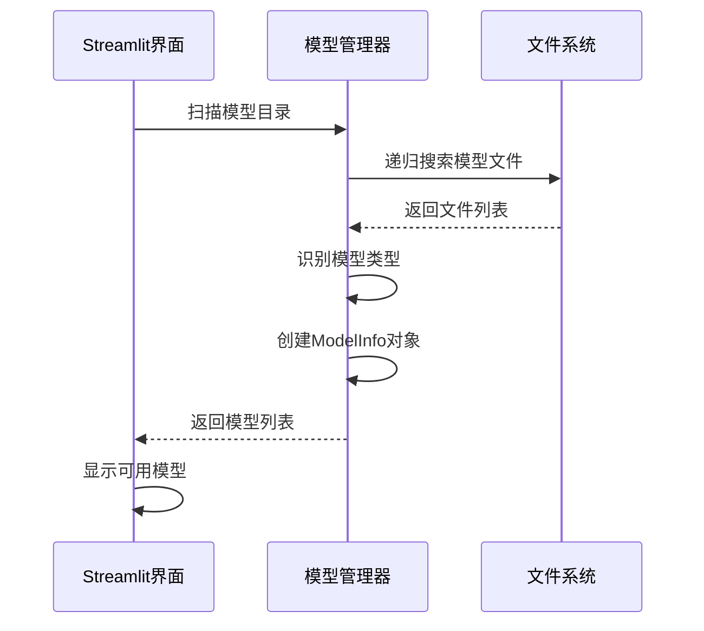
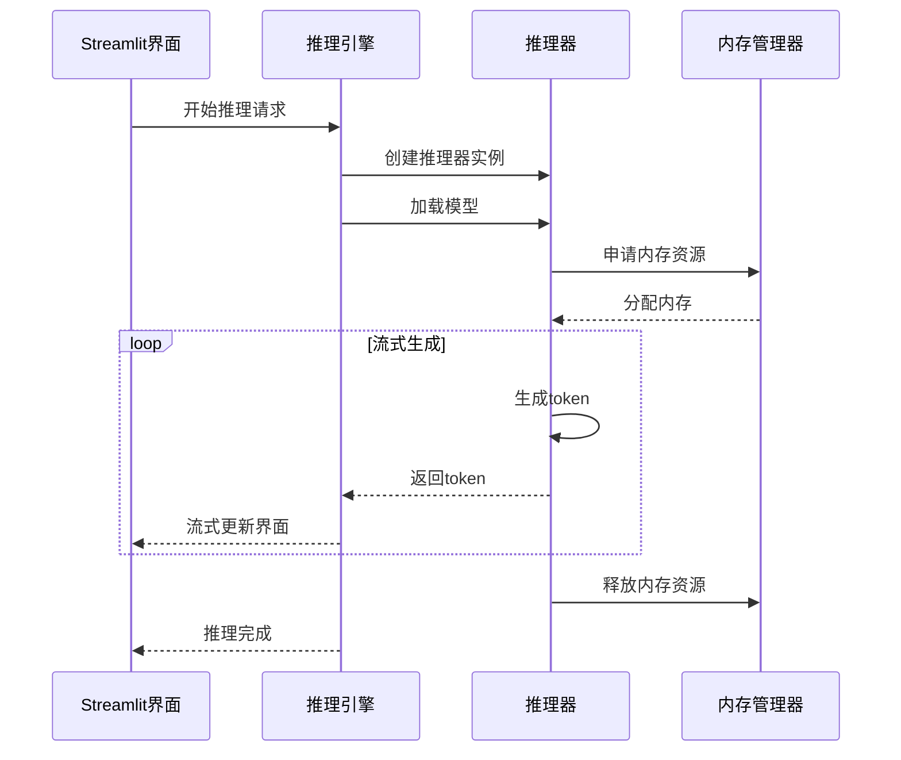
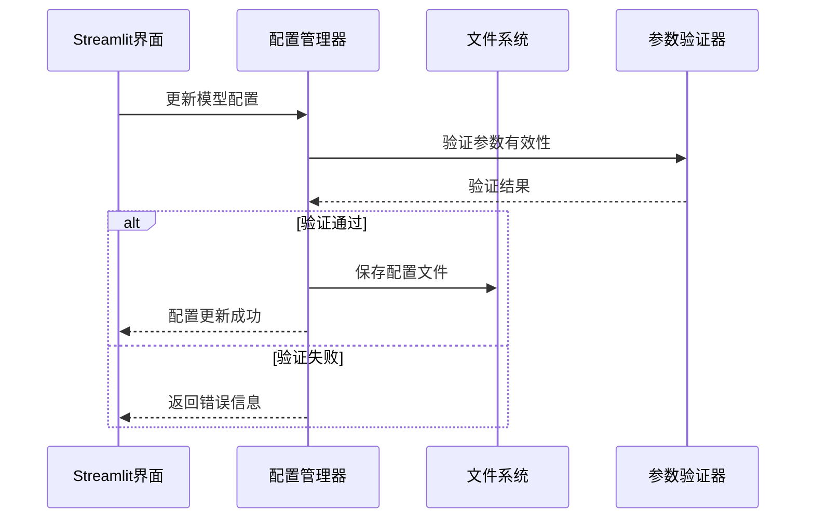
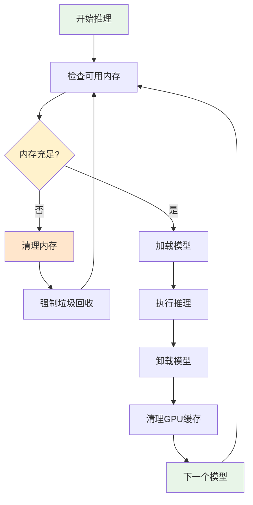

# 架构说明文档

本文档详细描述了多LLM模型比较器的系统架构、设计原则和技术实现。

## 系统概览

多LLM模型比较器采用分层架构设计，基于现代Python开发最佳实践，使用uv进行包管理，Streamlit构建用户界面。系统支持PyTorch和GGUF两种模型格式，通过内存优化策略实现多模型的高效比较。

### 核心设计原则

1. **模块化设计** - 各组件职责清晰，低耦合高内聚
2. **可扩展性** - 支持新的模型格式和推理引擎
3. **资源优化** - 智能内存管理，支持有限资源环境
4. **用户友好** - 直观的Web界面，实时反馈
5. **可维护性** - 清晰的代码结构，完善的测试覆盖

## 整体架构



## 分层架构详解

### 1. 用户界面层 (UI Layer)

**职责**: 提供用户交互界面，处理用户输入和结果展示

**组件**:
- **Streamlit Web界面** (`main.py`): 应用入口，主界面逻辑
- **UI组件** (`ui/components.py`): 可复用的界面组件
- **界面工具** (`ui/utils.py`): 界面辅助函数

**技术栈**:
- Streamlit: Web界面框架
- HTML/CSS: 自定义样式
- JavaScript: 客户端交互

**设计特点**:
- 响应式布局，支持多设备访问
- 实时更新，流式显示推理结果
- 直观的模型选择和参数配置界面

### 2. 应用服务层 (Service Layer)

**职责**: 实现核心业务逻辑，协调各组件交互

#### 模型管理器 (ModelManager)
```python
# 核心功能
- 模型文件扫描和发现
- 模型类型识别和分类
- 模型选择和验证
- 模型元数据管理

# 设计模式
- 单例模式: 确保全局唯一的模型管理实例
- 观察者模式: 模型状态变化通知
- 工厂模式: 根据文件类型创建模型信息对象
```

#### 推理引擎 (InferenceEngine)
```python
# 核心功能
- 推理器创建和管理
- 多模型并发推理协调
- 结果聚合和流式输出
- 错误处理和恢复

# 设计模式
- 策略模式: 根据模型类型选择推理策略
- 模板方法模式: 定义推理流程模板
- 责任链模式: 错误处理链
```

#### 配置管理器 (ConfigManager)
```python
# 核心功能
- 配置参数验证和管理
- 配置持久化存储
- 默认配置和用户配置合并
- 配置热更新支持

# 设计模式
- 建造者模式: 构建复杂配置对象
- 原型模式: 配置模板复制
```

#### 内存管理器 (MemoryManager)
```python
# 核心功能
- 内存使用监控
- 模型加载队列管理
- 资源清理和垃圾回收
- 内存泄漏检测

# 设计模式
- 对象池模式: 推理器对象复用
- 代理模式: 内存使用代理监控
```

### 3. 推理器层 (Inferencer Layer)

**职责**: 实现具体的模型推理逻辑

#### 基础推理器接口 (BaseInferencer)
```python
# 抽象接口定义
class BaseInferencer(ABC):
    @abstractmethod
    def load_model(self, model_path: str, config: Dict) -> None
    
    @abstractmethod
    def generate_stream(self, prompt: str) -> Iterator[str]
    
    @abstractmethod
    def unload_model(self) -> None
    
    @abstractmethod
    def get_model_info(self) -> Dict[str, Any]

# 设计优势
- 统一接口，支持多种推理引擎
- 易于扩展新的模型格式
- 便于单元测试和模拟
```

#### PyTorch推理器 (PyTorchInferencer)
```python
# 技术实现
- transformers库集成
- 多设备支持 (CUDA/MPS/CPU)
- 流式生成 (TextIteratorStreamer)
- 内存优化 (low_cpu_mem_usage)

# 性能优化
- 模型量化支持
- 批处理优化
- 缓存机制
```

#### GGUF推理器 (GGUFInferencer)
```python
# 技术实现
- llama-cpp-python集成
- 硬件加速 (CUDA/OpenCL/Metal)
- 量化模型支持
- 上下文管理

# 性能优化
- 多线程推理
- 内存映射
- 批处理支持
```

### 4. 核心数据层 (Core Data Layer)

**职责**: 定义数据模型和业务规则

#### 数据模型设计
```python
# 领域驱动设计 (DDD)
- ModelInfo: 模型信息聚合根
- InferenceResult: 推理结果值对象
- ModelConfig: 配置值对象
- InferenceStats: 统计信息值对象

# 数据验证
- Pydantic模型验证
- 类型注解支持
- 自动序列化/反序列化
```

## 数据流架构

### 1. 模型发现流程



### 2. 推理执行流程



### 3. 配置管理流程



## 内存管理架构

### 内存优化策略

1. **顺序加载**: 避免同时加载多个大模型
2. **及时释放**: 推理完成后立即卸载模型
3. **垃圾回收**: 强制执行Python和GPU垃圾回收
4. **内存监控**: 实时监控内存使用情况

### 内存管理流程



## 错误处理架构

### 异常层次结构

```python
MultiLLMError (基础异常)
├── ModelNotFoundError (模型未找到)
├── ModelLoadError (模型加载失败)
│   ├── InsufficientMemoryError (内存不足)
│   └── UnsupportedFormatError (格式不支持)
├── InferenceError (推理异常)
│   ├── GenerationTimeoutError (生成超时)
│   └── TokenizationError (分词错误)
└── ConfigurationError (配置异常)
    ├── InvalidParameterError (参数无效)
    └── ValidationError (验证失败)
```

### 错误恢复策略

1. **重试机制**: 临时性错误自动重试
2. **降级处理**: 失败时使用备选方案
3. **用户友好**: 提供清晰的错误信息和解决建议
4. **日志记录**: 详细记录错误信息用于调试

## 性能优化架构

### 1. 计算性能优化

```python
# GPU加速
- CUDA支持 (NVIDIA GPU)
- MPS支持 (Apple Silicon)
- OpenCL支持 (通用GPU)

# 模型优化
- 量化模型支持 (INT4, INT8, FP16)
- 模型编译优化 (torch.compile)
- 批处理推理

# 内存优化
- 内存映射加载
- 低内存模式
- 动态内存管理
```

### 2. I/O性能优化

```python
# 文件I/O
- 异步文件读取
- 内存映射文件
- 缓存机制

# 网络I/O
- 流式响应
- 压缩传输
- 连接池
```

### 3. 用户体验优化

```python
# 界面响应
- 异步处理
- 进度指示
- 实时更新

# 缓存策略
- 模型元数据缓存
- 配置缓存
- 结果缓存
```

## 扩展性架构

### 1. 插件系统设计

```python
# 推理器插件
class InferencerPlugin:
    def create_inferencer(self, model_type: str) -> BaseInferencer
    def supported_formats(self) -> List[str]
    def get_metadata(self) -> Dict[str, Any]

# 插件注册
plugin_manager.register_inferencer_plugin(CustomInferencerPlugin())
```

### 2. 配置扩展

```python
# 自定义配置
class CustomModelConfig(ModelConfig):
    custom_param: float = 1.0
    advanced_settings: Dict[str, Any] = field(default_factory=dict)

# 配置验证扩展
def custom_validator(config: CustomModelConfig) -> None:
    if config.custom_param < 0:
        raise ValidationError("custom_param must be positive")
```

### 3. UI扩展

```python
# 自定义UI组件
def custom_model_selector(models: List[ModelInfo]) -> List[str]:
    # 自定义模型选择界面
    return selected_model_ids

# 组件注册
ui_manager.register_component("model_selector", custom_model_selector)
```

## 部署架构

### 1. 本地部署

```bash
# 开发环境
uv run streamlit run src/multi_llm_comparator/main.py

# 生产环境
uv run streamlit run src/multi_llm_comparator/main.py --server.port 8501 --server.address 0.0.0.0
```

### 2. 容器化部署

```dockerfile
FROM python:3.12-slim

# 安装uv
RUN pip install uv

# 复制项目文件
COPY . /app
WORKDIR /app

# 安装依赖
RUN uv sync --frozen

# 暴露端口
EXPOSE 8501

# 启动应用
CMD ["uv", "run", "streamlit", "run", "src/multi_llm_comparator/main.py", "--server.address", "0.0.0.0"]
```

### 3. 分布式部署

```python
# 推理服务分离
class RemoteInferencer(BaseInferencer):
    def __init__(self, endpoint: str):
        self.endpoint = endpoint
    
    def generate_stream(self, prompt: str) -> Iterator[str]:
        # 调用远程推理服务
        response = requests.post(f"{self.endpoint}/generate", 
                               json={"prompt": prompt}, 
                               stream=True)
        for chunk in response.iter_content():
            yield chunk.decode()
```

## 监控和日志架构

### 1. 日志系统

```python
# 结构化日志
import structlog

logger = structlog.get_logger()

# 日志配置
logging.config.dictConfig({
    "version": 1,
    "handlers": {
        "file": {
            "class": "logging.handlers.RotatingFileHandler",
            "filename": "app.log",
            "maxBytes": 10485760,  # 10MB
            "backupCount": 5
        }
    }
})
```

### 2. 性能监控

```python
# 性能指标收集
class PerformanceMonitor:
    def track_inference_time(self, model_id: str, duration: float):
        # 记录推理时间
        pass
    
    def track_memory_usage(self, usage: int):
        # 记录内存使用
        pass
    
    def track_error_rate(self, error_type: str):
        # 记录错误率
        pass
```

### 3. 健康检查

```python
# 健康检查端点
def health_check() -> Dict[str, Any]:
    return {
        "status": "healthy",
        "version": "1.0.0",
        "models_loaded": len(model_manager.get_selected_models()),
        "memory_usage": psutil.virtual_memory().percent,
        "gpu_available": torch.cuda.is_available()
    }
```

## 安全架构

### 1. 输入验证

```python
# 输入清理和验证
def sanitize_prompt(prompt: str) -> str:
    # 移除潜在的恶意内容
    # 限制输入长度
    # 过滤特殊字符
    return cleaned_prompt
```

### 2. 资源限制

```python
# 资源使用限制
class ResourceLimiter:
    def __init__(self, max_memory_gb: int = 16, max_inference_time: int = 300):
        self.max_memory = max_memory_gb * 1024**3
        self.max_time = max_inference_time
    
    def check_limits(self):
        # 检查内存和时间限制
        pass
```

### 3. 访问控制

```python
# 简单的访问控制
def require_auth(func):
    def wrapper(*args, **kwargs):
        # 验证用户权限
        if not is_authorized():
            raise UnauthorizedError("Access denied")
        return func(*args, **kwargs)
    return wrapper
```

这个架构文档提供了系统的全面技术视图，帮助开发者理解系统设计和实现细节，为后续的开发和维护提供指导。